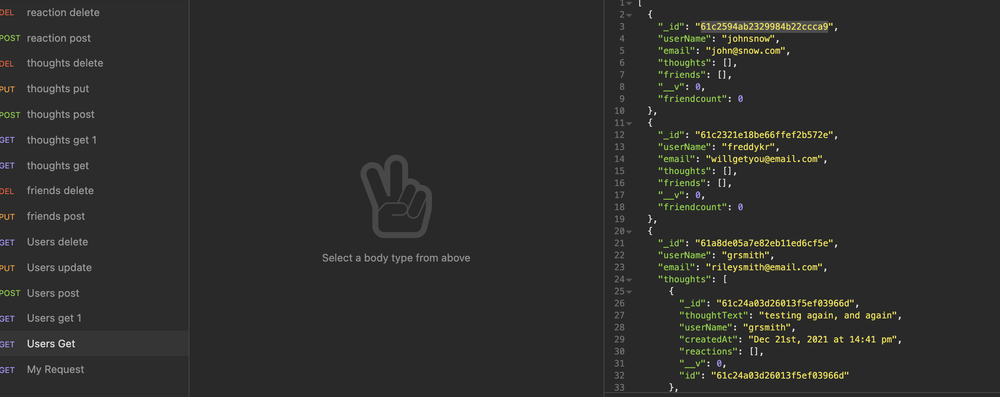

# The-Semi-Social-Network
        
## Description
This project was to provide the backend for a social network site that will allow users to sign up, add friends, share their thouthts, and comment on thoughts.

## Table of Contents
* [Installation](#installation)
* [Screenshot](#screenshot)
* [Contributions](#contribution)
* [Languages](#languages)
* [Github](#github)
* [links](#links)
    
## Installation
Clone the repository from git@github.com:grsmith35/the-semi-social-network.git then from in the terminal from the root directory type 'npm install' then type 'npm start' to start the server. 

## Screenshot
See screenshot to see available routes.

## Contribution
Riley Smith

## Languages
This was written using noSQL and mongoDB and Javascript.

## Github
[Github profile](https://github.com/grsmith35)

## Links
Here are the links to the recorded videos
[Video #1](https://watch.screencastify.com/v/JIzPVINjKXwwKKPl5IQB)
[Video #2](https://watch.screencastify.com/v/FHpL8xRu12Ss6ad9xmDF)

## Questions
If you have any questions on this code please reachout to me at gordonrileysmith@gmail.com.

## Challenges
This project got caught up on the little things. I could not get the query for users to pull their thoughts because the reference was mispelled. This was a fun project.